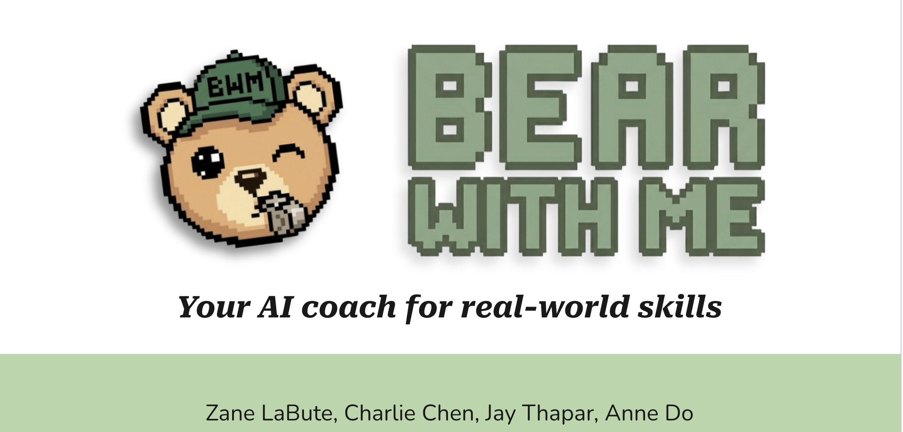
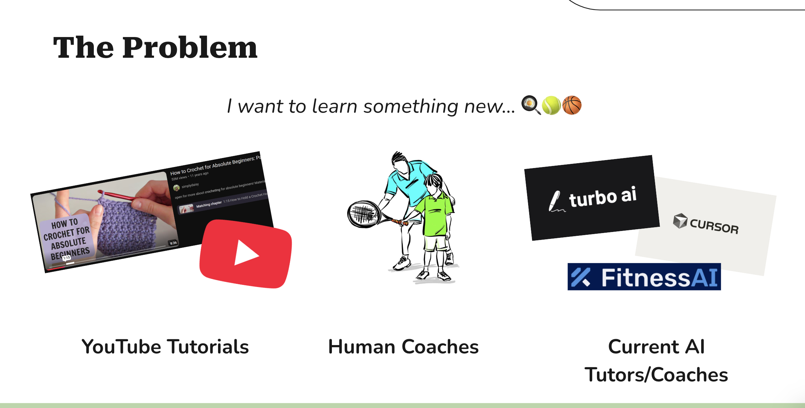
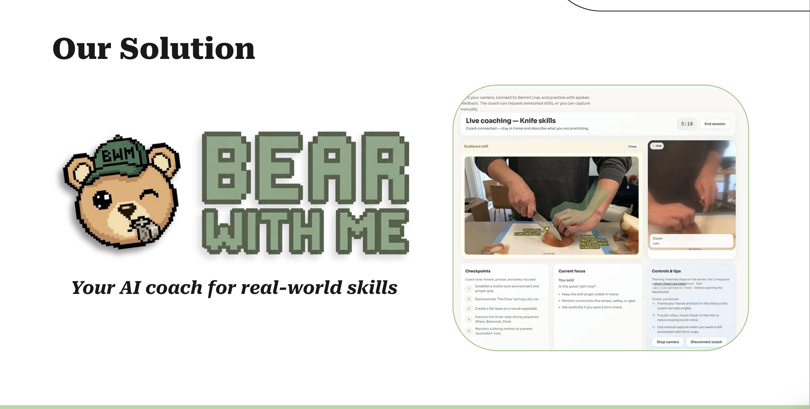
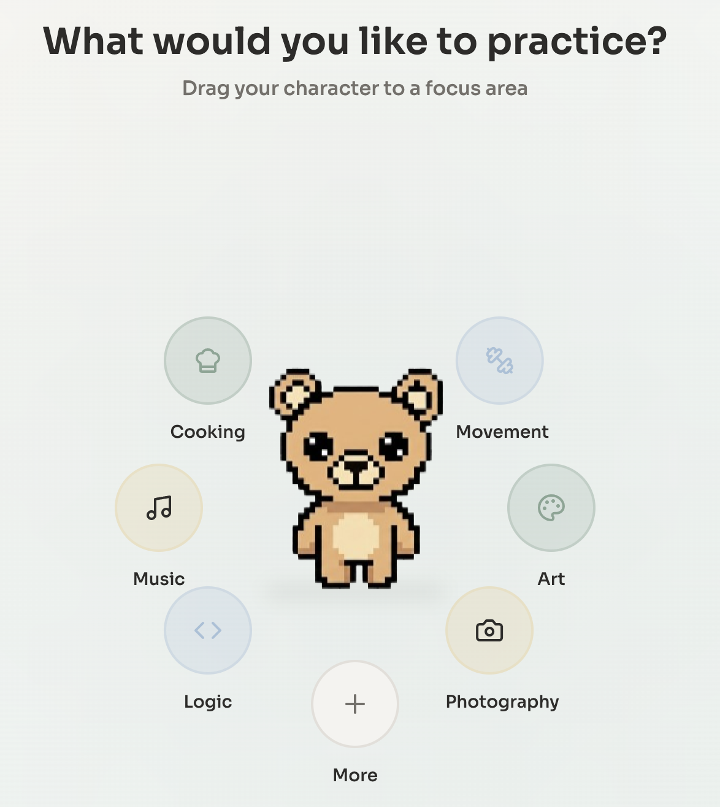
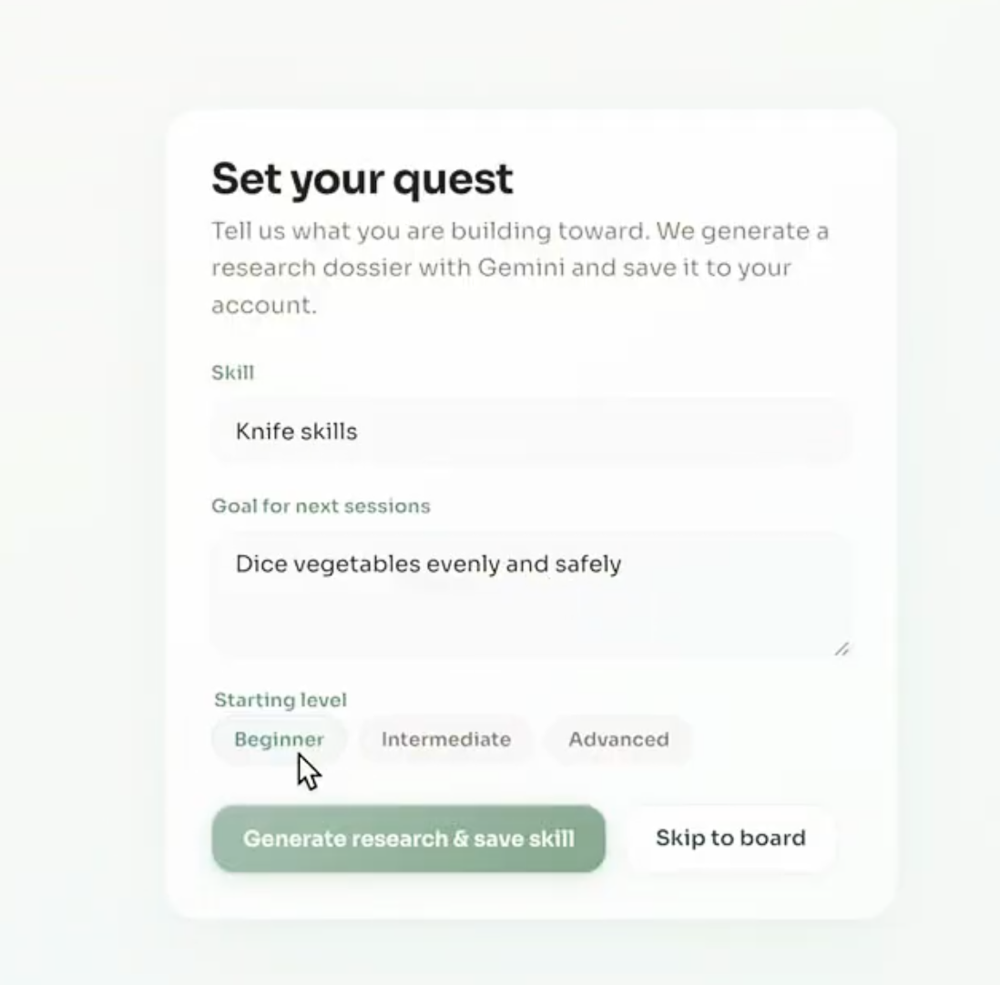
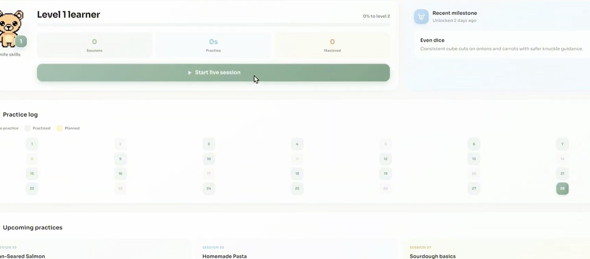
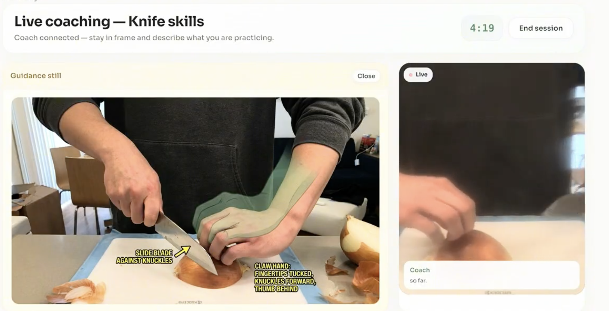

# Bear With Me

Your AI coach for real-world skills.



Bear With Me is a multimodal coaching app that helps learners practice real skills with live feedback, visual corrections, and persistent progression. Instead of acting like a generic chat assistant, it researches a skill, launches a live coaching session, and generates annotated feedback directly on the learner's own practice footage.

Hackathon mode on this branch uses a FastAPI backend, a Vite + React frontend, Gemini Live for realtime coaching, Gemini image generation for annotated stills, and a shared public skill pool stored in SQLite by default.

## What It Does

- Create a skill and define a concrete learning goal.
- Generate a Gemini research dossier for that skill.
- Start a live coaching session with camera and microphone.
- Receive spoken feedback in realtime.
- Capture annotated stills when visual correction is more useful than verbal guidance.
- Persist session summaries and progression across practice sessions.

## The Problem



Learning real-world skills still has three major gaps:

- YouTube tutorials are broad, one-way, and not personalized to what you are doing wrong right now.
- Human coaches are powerful, but expensive, scarce, and not always available on demand.
- Current AI tutors are usually chat-first products with weak connection to embodied practice.

For skills like cooking, movement, music posture, or other physical techniques, the hard part is not access to information. The hard part is getting timely, specific feedback while practicing.

## Our Solution



Bear With Me is a generalized coaching engine for skill-building.

The system first creates a structured knowledge base for the selected skill, then uses that context during a live Gemini session to coach the learner in real time. When words are not enough, it captures a still from the learner's own video and generates visual corrections directly on top of the frame.

That creates a tighter learning loop:

1. Research the skill.
2. Coach the learner live.
3. Generate visual corrections when needed.
4. Save progress and carry context forward to the next session.

## Why It’s Different

- Research-first coaching: the app creates a skill dossier before coaching instead of relying on a generic prompt.
- Live multimodal feedback: the coach responds to camera and microphone input, not just text.
- Visual correction on your own footage: annotated stills are generated from the learner's actual frame.
- Persistent progression: sessions update a stored journey with level, streak, practice time, and summaries.
- Generalizable engine: the architecture is meant to support many skill domains, even though the current demo is strongest for cooking / knife skills.

## Demo Flow

### 0. Pick a focus area

The experience starts with a playful skill picker that makes the product feel like a guided journey rather than a generic form app.



### 1. Create your skill

The learner enters a skill, a concrete goal, and a starting level. The backend generates a Gemini research dossier and persists the new skill.



### 2. Review your journey

The dashboard shows the selected skill, current level, accumulated practice, streak, and progress toward the next level.



### 3. Start a live coaching session

The learner starts camera and microphone, connects to Gemini Live, and receives concise realtime spoken guidance. When verbal feedback is insufficient, the app captures a still and generates a marked-up correction image showing the intended posture, grip, or motion.



## How It Works

The current branch implements the following pipeline:

1. The user creates a skill from the frontend onboarding flow.
2. The backend generates a research dossier with Gemini and stores it in the database.
3. The user starts a live session for that skill.
4. The backend mints an ephemeral Gemini Live token and assembles a skill-specific system instruction from:
   - stored skill metadata
   - latest research dossier
   - recent progress events
   - recent session summaries
5. Gemini Live provides spoken coaching during the session.
6. The frontend can request form correction by sending a captured video frame to the backend.
7. The backend uses the configured Gemini image model to return an annotated still.
8. When the session ends, the backend updates progression stats, persists a session summary, and optionally attempts Docs export.

## Product Architecture

### Research layer

Skill creation triggers a Gemini-generated markdown dossier covering:

- overview
- core concepts
- skill decomposition
- milestones
- practice design
- common mistakes
- resources
- safety notes when relevant

This research row becomes part of the live coaching context.

### Live coaching layer

The session experience combines:

- browser camera + mic capture
- Gemini Live realtime connection
- dynamic system-instruction assembly from persisted skill memory
- short spoken coaching responses

### Visual correction layer

Annotated stills are generated from the learner's own camera frame. The image model is prompted to show the corrected posture or tool position, not just overlay arrows on top of a mistake.

### Persistence layer

The backend stores:

- skills
- research entries
- progress events
- session summaries

This is what allows the app to keep a memory of practice over time.

## Current Tech Stack

### Frontend

- React
- TypeScript
- Vite
- React Router

### Backend

- FastAPI
- Uvicorn
- SQLModel / SQLAlchemy

### AI

- Gemini Live API
- Gemini text generation for skill research
- Gemini image generation for annotated stills

### Persistence

- SQLite by default
- Postgres-compatible deployment path via `DATABASE_URL`

### Google ecosystem

- Ephemeral token flow for Gemini Live
- Session-summary export hooks for Google Docs

## Current Branch Scope

This branch is a hackathon-mode implementation, not a fully productized system.

What is already working or concretely represented in code:

- shared skill creation
- Gemini-generated research dossiers
- live coaching flow
- annotated still generation
- persistent skill stats and session summaries

What is still partial, aspirational, or scaffolded relative to the broader concept:

- richer multi-session personalization
- explicit intervention-tier orchestration
- deeper Google Workspace loop
- grounded YouTube / Search-based research ingestion
- broader proof across multiple skill categories

## Screenshots

The README uses product screenshots from [`screenshots/`](screenshots/). The strongest core assets on this branch are:

- `hero-banner.png`
- `problem-slide.png`
- `solution-slide.png`
- `skill-select-arena.png`
- `onboarding-flow.png`
- `dashboard-journey.png`
- `live-annotated-session.png`

## Repo Structure

```txt
backend/      FastAPI API, DB models, routers, Gemini services
frontend/     React app, routes, live session UI, client-side API hooks
screenshots/  README and demo assets
.cursor/      Planning artifacts
```

## Prerequisites

- Python 3.11+ (3.12 recommended)
- Node.js 20+ and npm

## Local Setup

### 1. Backend

```bash
cd backend
python3 -m venv .venv
source .venv/bin/activate
pip install -r requirements.txt
```

Optional:

```bash
cp ../.env.example .env
```

Start the API:

```bash
uvicorn app.main:app --reload --host 127.0.0.1 --port 3000
```

Check health:

```bash
curl -s http://127.0.0.1:3000/api/health
```

API docs:

- http://127.0.0.1:3000/docs

### 2. Frontend

In a second terminal:

```bash
cd frontend
npm install
npm run dev
```

Open the Vite URL shown in the terminal, usually:

- http://localhost:5173

### 3. Frontend production build

```bash
cd frontend
npm run build
npm run preview
```

If the frontend is served outside the Vite dev server, set `VITE_API_URL` so the browser can reach FastAPI directly.

## Configuration

| Variable | Where | Purpose |
| --- | --- | --- |
| `CORS_ORIGINS` | `backend/.env` | Allowed browser origins |
| `GEMINI_API_KEY` | `backend/.env` | Server-side Gemini key |
| `GEMINI_LIVE_MODEL` | `backend/.env` | Live model for coaching |
| `GEMINI_IMAGE_MODEL` | `backend/.env` | Image model for annotated stills |
| `GEMINI_RESEARCH_MODEL` | `backend/.env` | Text model for research dossiers |
| `DATABASE_URL` | `backend/.env` | Optional DB override; defaults to SQLite |
| `VITE_API_URL` | `frontend/.env` | Optional API base for non-dev deployments |

Full placeholder list:

- [`.env.example`](.env.example)

## Shared Skill Pool Note

This branch currently uses a shared public pool model rather than private per-user accounts. Skills, research, and progress data are persisted in the database, but there is no sign-in gate protecting individual records. That is appropriate for a hackathon demo, not for private production data.

## Future Work

- Ground research in YouTube and Search-backed sources
- Build a richer learner model across repeated sessions
- Formalize intervention tiers and escalation rules
- Expose Google Workspace artifacts more directly in the product loop
- Demonstrate stronger cross-domain skill coverage beyond the current cooking-focused demo
